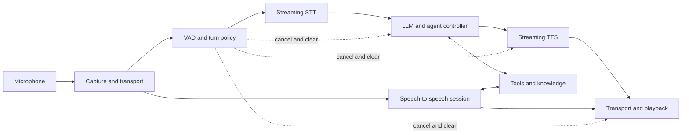

# Conversational Voice AI Engineering

Learn how conversational voice agents work, from audio samples and language models to interruption handling, tools, telephony, evaluation, and production operations.

This is an independent, framework-neutral engineering course. **TEN Framework is a source-reading reference**, not the identity of the course. The architecture, labs, and reasoning should transfer to another runtime or a custom implementation. No AWS sample repository is required.

## Start learning

1. Read [Getting started](GETTING_STARTED.md) and [the learning path](SYLLABUS.md).
2. Work through [the chapters](chapters/README.md), in order if voice engineering is new to you.
3. Complete [12 progressive labs](labs/README.md). The first experiments run offline with Python's standard library.
4. Follow [the TEN source map](code-reading/README.md) to connect concepts to real implementation code.
5. Build [the capstone](capstone/README.md) and assess it with the published rubric.

## What you will understand

| Layer | Questions you will be able to answer |
| --- | --- |
| Audio | What is PCM? Why do sample rate, channels, frame duration, codecs, and resampling matter? |
| Models | How do STT, LLMs, TTS, and speech-to-speech models process information internally? |
| Conversation | How do VAD, endpointing, turn detection, and barge-in differ? What must cancellation stop? |
| Runtime | How do events, state machines, streaming queues, and backpressure keep a session coherent? |
| Actions | How do tools, MCP, RAG, memory, and workflows become safe and useful during speech? |
| Channels | What do WebRTC, WebSocket, SIP, RTP, and PSTN each do? |
| Understanding | How do diarization, overlapping speech, visual context, and conversational co-pilots work? |
| Production | How do you measure latency, evaluate quality, recover from failures, protect data, and scale sessions? |



The diagram is conceptual. Some implementations put turn detection inside a provider session; others put it in the runtime. Trace ownership rather than assuming every box is a separate service.

## Included material

- 22 explanatory chapters with internal mechanisms, worked examples, failure cases, and understanding checks.
- 12 lab guides with steps, observable deliverables, and acceptance criteria.
- Runnable offline experiments for PCM, endpointing, stale-output rejection, idempotency, and latency statistics.
- Commit-pinned TEN walkthroughs for the cascaded pipeline, turn control, and realtime architecture.
- Study guides for the two supplied AI Engineer talks, [Beyond Transcription](resources/beyond-transcription.md) and [The Voice-First AI Overlay](resources/voice-first-overlay.md).
- [Glossary](reference/glossary.md), [answer guide](reference/answers.md), [troubleshooting](reference/troubleshooting.md), and [production checklist](reference/production-checklist.md).
- [Instructor guidance](teaching/README.md), contribution templates, and documentation validation in GitHub Actions.

## Run the offline experiments

Requires Python 3.9 or newer. No packages, API keys, GPU, or Docker are needed for these simulations.

```bash
python3 examples/audio_frames.py
python3 examples/turn_runtime.py
python3 examples/tool_idempotency.py
python3 examples/latency_report.py fixtures/turns.jsonl
python3 scripts/check_docs.py
python3 -m unittest discover -s tests -v
```

These are teaching experiments, not an end-to-end microphone agent. Live labs require a transport, provider accounts or local models, and potentially paid usage. [Getting started](GETTING_STARTED.md) explains the boundary.

## Learning pace

Use the [six-week plan](SYLLABUS.md) for a cohort, or study one chapter and its related exercise at a time. Prior programming experience helps; no speech processing or machine learning background is assumed. Model-training mathematics is introduced to explain behavior, not to require training a foundation model.

## Sources and maintenance

The course continues a prior Conversational Voice AI Engineering course design. It is newly authored Markdown; it does not reproduce the earlier downloadable booklet. External talks and source repositories retain their own licenses. Links, evidence status, and the TEN reference commit are recorded in [the resource index](resources/README.md) and [source manifest](resources/sources.json).

Provider model names, prices, SDKs, and setup instructions change. The conceptual chapters avoid promising current provider capabilities. TEN links use the inspected commit `1b78cb725910d6f63389ef4ae69b182854d5b9d9`; upgrade deliberately using the source-reading guide.

Contributions are welcome: see [CONTRIBUTING](CONTRIBUTING.md). Original course text and example code use the [MIT license](LICENSE). This repository is not affiliated with TEN, pyannoteAI, AI Engineer, or any model or transport vendor.
