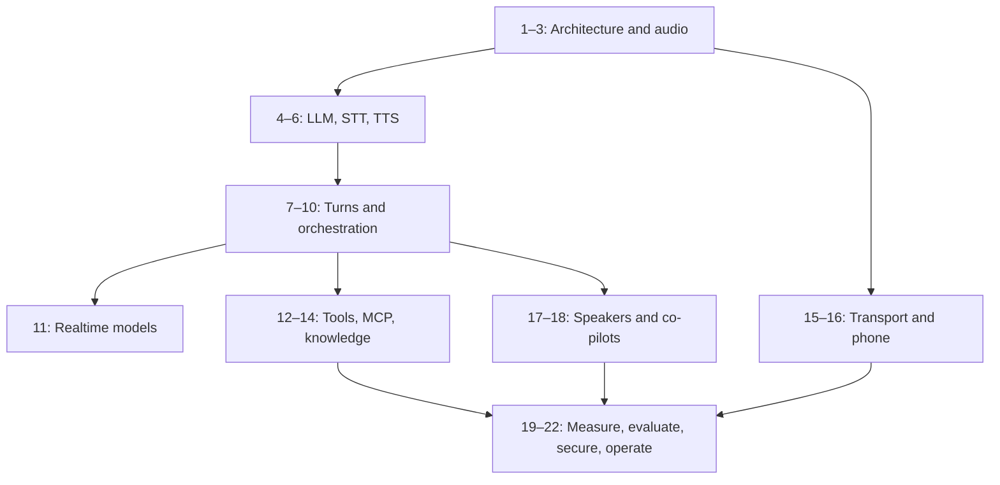

# Learning path and six-week plan

The course moves through **hear → recognize → reason → speak → take turns → act → understand → measure → operate**. Chapters contain explanations; labs produce evidence that you understand them.

| Week | Read | Build | Demonstrate |
| --- | --- | --- | --- |
| 1 | Chapters 1–6: architectures, audio, streaming, LLM, STT, TTS | Labs 1–3 | Explain bytes, transcript revisions, and first-audio delay |
| 2 | Chapters 7–10: VAD, turn detection, interruption, runtime | Labs 4–5 | Interrupt output without letting stale chunks return |
| 3 | Chapters 11–14: realtime models, tools, MCP, retrieval and memory | Labs 6–7 | Compare architectures and execute a retry-safe action |
| 4 | Chapters 15–17: transport, telephony, diarization | Labs 8–9 | Trace format conversion and preserve speaker attribution |
| 5 | Chapters 18–20: multimodal co-pilots, latency, evaluation | Labs 10–11 | Explain a tail-latency result and evaluate intervention timing |
| 6 | Chapters 21–22: security, reliability and deployment | Lab 12 and capstone | Present failure recovery, access boundaries, and measured quality |

Suggested cohort format: one concept session, one source-reading discussion, and one practical session each week. Allow roughly 6–10 hours weekly for readers with backend programming experience; this is a planning estimate, not a completion guarantee.

## Prerequisite graph

## What mastery means

Explain the internals in your own words. Trace one real event through source code. Design a failure experiment. Measure its outcome. Finally, describe the same solution without naming TEN or a provider SDK.

For each week submit one architecture diagram, one trace, one failure analysis, and one transfer note. This prevents framework configuration knowledge from being mistaken for engineering understanding.

## Optional deeper study

Study attention algebra after chapter 4, CTC alignment after chapter 5, phonemes and vocoders after chapter 6, and transport specifications after chapters 15–16. These deepen the mechanism without blocking the introductory path. Use the [primary-source bibliography](resources/README.md).

[Course](README.md) · [Chapters](chapters/README.md) · [Labs](labs/README.md)
