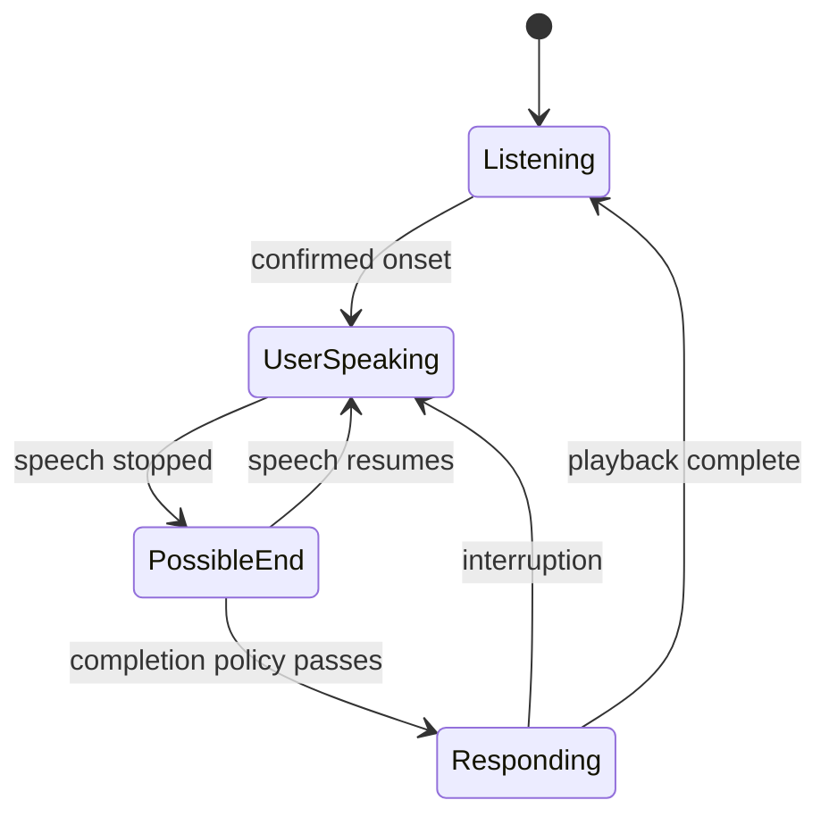

# 8. Endpointing and conversational turn detection

**Prerequisites:** chapters 5 and 7. **Goal:** decide when a user is done without collapsing different meanings of “final”.

## Three questions, three answers

VAD asks whether speech is present. Recognition finalization asks whether a transcript segment is stable. Turn detection asks whether it is appropriate for the assistant to take the floor. These signals can disagree without any component being broken.

“I want to book…” followed by a 600 ms pause may be unfinished speech. “No.” followed by a shorter pause may be a complete turn. A fixed silence timeout cannot represent both intentions well.

## Silence endpointing

A common controller starts a timer after speech stops and commits the turn once enough silence passes. Short timeouts reduce response delay but increase premature cuts. Long timeouts protect hesitant users but make short exchanges sluggish.

If `last_speech_end` is 2,000 ms and the silence threshold is 500 ms, the earliest timeout decision is around 2,500 ms, plus scheduling and transport effects. The timeout has already consumed half a second before generation starts.

VAD frame smoothing and ASR buffering can add hidden delay before the timer begins. Record the semantic definition of each timestamp. “VAD stop received” is not necessarily the true end of the acoustic signal.

## Semantic completion

A semantic turn detector can use transcript content, acoustic cues, or both to estimate completion. An unfinished conjunction, rising intonation, or an explicit hesitation may signal continuation. A text-only detector cannot directly hear prosody; an audio-aware detector needs suitable acoustic input.

Treat the estimate as evidence under a policy. False endpoints interrupt users; missed endpoints make them repeat themselves. Completion thresholds should be validated by language, speaking style, assistive needs, and noise conditions rather than assumed to generalize universally.

## A controller state machine

Text can become stable while the state remains `PossibleEnd`. Store it, but do not necessarily trigger generation. New speech cancels the pending endpoint timer. Ensure an old timer cannot fire after state has changed: associate it with a turn or generation ID.

## Backchannels and ambiguous speech

“Mm-hm” may be acknowledgement rather than a request to take the floor. Some systems should pause on any speech onset; others distinguish cooperative backchannels from interruption. Start with explicit, observable policies before adding complex classifiers.

Allow the user to recover: “Sorry, go ahead” after a false cut can be better than stubbornly completing an answer. Track false-interruption rates alongside speed. Do not hide every policy error behind an apology prompt.

## Speculation

You can prefetch retrieval or begin a tentative model response on a stable prefix, then cancel if more speech arrives. This trades compute for latency. Keep speculative output private until the turn policy permits it, and never execute a consequential tool from an uncommitted prefix.

The user saying “cancel—actually don't” illustrates why speculative reads and speculative writes deserve different treatment.

## Experiment

Replay the same utterances under 200, 500, and 900 ms silence thresholds. Include a short “yes,” a hesitation before a date, background speech, and a self-correction. Annotate human-perceived completion. Plot or tabulate response gap and premature endpoint count. The best policy depends on the task and population.

## Check your understanding

1. Why does `ASR final` not necessarily mean `turn final`?
2. How can a stale endpoint timer trigger a second response?
3. Which speculative operations can safely run before commitment?

Continue with [interruption](09-interruption-and-cancellation.md). [Lab 4](../labs/04-turn-policy.md). Reference implementation: [TEN turn detection](https://github.com/ten-framework/ten-turn-detection).
