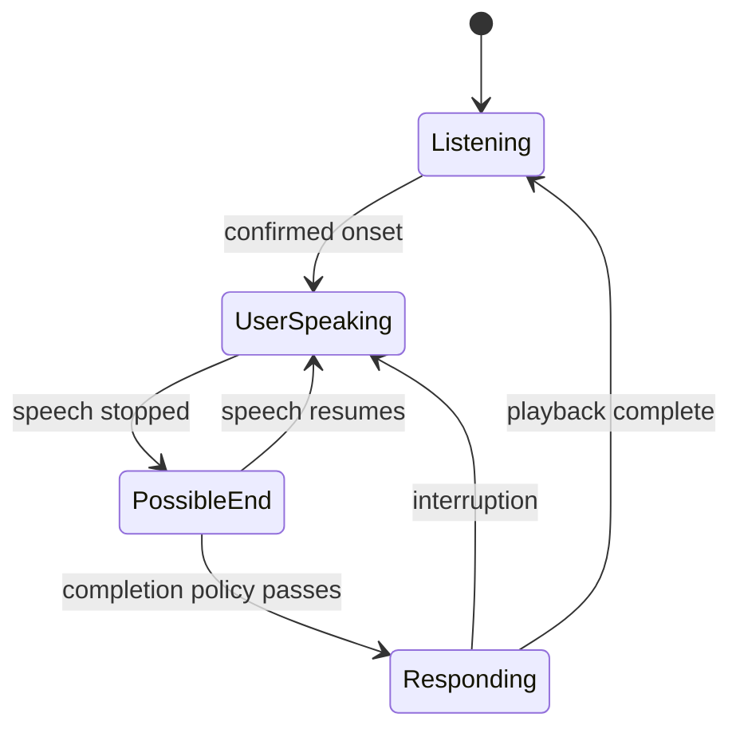

# 8. Endpointing and conversational turn detection

**Prerequisites:** chapters 5 and 7. **Goal:** decide when a user is done without collapsing different meanings of “final”.

<!-- chapter-navigation:start -->
**In this chapter**

- [Three questions, three answers](#three-questions-three-answers)
- [Silence endpointing](#silence-endpointing)
- [Semantic completion](#semantic-completion)
- [A controller state machine](#a-controller-state-machine)
- [Backchannels and ambiguous speech](#backchannels-and-ambiguous-speech)
- [Speculation](#speculation)
- [Experiment](#experiment)
- [Design a turn policy from explicit evidence](#design-a-turn-policy-from-explicit-evidence)
- [Specify state transitions and timer guards](#specify-state-transitions-and-timer-guards)
- [Backchannels require a product decision](#backchannels-require-a-product-decision)
- [Speculation with a commit barrier](#speculation-with-a-commit-barrier)
- [Evaluate endpoints against annotated intent](#evaluate-endpoints-against-annotated-intent)
- [Check your understanding](#check-your-understanding)
<!-- chapter-navigation:end -->

## Three questions, three answers

VAD asks whether speech is present. Recognition finalization asks whether a transcript segment is stable. Turn detection asks whether it is appropriate for the assistant to take the floor. These signals can disagree without any component being broken.

“I want to book…” followed by a 600 ms pause may be unfinished speech. “No.” followed by a shorter pause may be a complete turn. A fixed silence timeout cannot represent both intentions well.

## Silence endpointing

A common controller starts a timer after speech stops and commits the turn once enough silence passes. Short timeouts reduce response delay but increase premature cuts. Long timeouts protect hesitant users but make short exchanges sluggish.

If `last_speech_end` is 2,000 ms and the silence threshold is 500 ms, the earliest timeout decision is around 2,500 ms, plus scheduling and transport effects. The timeout has already consumed half a second before generation starts.

VAD frame smoothing and ASR buffering can add hidden delay before the timer begins. Record the semantic definition of each timestamp. “VAD stop received” is not necessarily the true end of the acoustic signal.

## Semantic completion

A semantic turn detector can use transcript content, acoustic cues, or both to estimate completion. An unfinished conjunction, rising intonation, or an explicit hesitation may signal continuation. A text-only detector cannot directly hear prosody; an audio-aware detector needs suitable acoustic input.

Treat the estimate as evidence under a policy. False endpoints interrupt users; missed endpoints make them repeat themselves. Completion thresholds should be validated by language, speaking style, assistive needs, and noise conditions rather than assumed to generalize universally.

## A controller state machine



Text can become stable while the state remains `PossibleEnd`. Store it, but do not necessarily trigger generation. New speech cancels the pending endpoint timer. Ensure an old timer cannot fire after state has changed: associate it with a turn or generation ID.

## Backchannels and ambiguous speech

“Mm-hm” may be acknowledgement rather than a request to take the floor. Some systems should pause on any speech onset; others distinguish cooperative backchannels from interruption. Start with explicit, observable policies before adding complex classifiers.

Allow the user to recover: “Sorry, go ahead” after a false cut can be better than stubbornly completing an answer. Track false-interruption rates alongside speed. Do not hide every policy error behind an apology prompt.

## Speculation

You can prefetch retrieval or begin a tentative model response on a stable prefix, then cancel if more speech arrives. This trades compute for latency. Keep speculative output private until the turn policy permits it, and never execute a consequential tool from an uncommitted prefix.

The user saying “cancel—actually don't” illustrates why speculative reads and speculative writes deserve different treatment.

## Experiment

Replay the same utterances under 200, 500, and 900 ms silence thresholds. Include a short “yes,” a hesitation before a date, background speech, and a self-correction. Annotate human-perceived completion. Plot or tabulate response gap and premature endpoint count. The best policy depends on the task and population.

## Design a turn policy from explicit evidence

Use three inputs: speech activity, transcript stability, and completion likelihood. A simple controller might permit commitment when speech has stopped, stable text exists, and either semantic completion is high or a maximum waiting deadline expires. Each condition has a different purpose.

Speech offset prevents responding over clear ongoing speech. Stable text reduces revisions to the input passed to the model. Semantic likelihood distinguishes “yes” from “I need to…”. A maximum wait prevents a detector from holding the floor forever. The deadline must have a truthful recovery behavior when the input is still ambiguous; it need not mean “execute the guessed intent.”

### Work through a hesitation

```text
0–900 ms       user: "I need a repair for"
900–1300 ms    pause
1300–1700 ms   user: "Saturday"
1700–2300 ms   silence
```

With a 300 ms silence timeout, a controller can commit at 1,200 ms, before “Saturday” begins. With 500 ms, the first pause is insufficient, so the controller waits and eventually commits around 2,200 ms. These outcomes follow directly from the timeline.

Now use the utterance “yes” ending at 200 ms. A 900 ms timeout commits around 1,100 ms despite a clearly short answer. The same threshold that protects a hesitation can make acknowledgements feel unnecessarily slow. A semantic policy might shorten waiting for “yes,” but should not assume every brief word is a complete response in every language or context.

## Specify state transitions and timer guards

Represent an endpoint candidate by `(user_turn_id, candidate_version, deadline)`. Every new continuation increments `candidate_version`. The timer callback compares its saved version with the current one before committing.

This **conceptual pseudocode** shows the guard:

```text
on speech offset:
    candidate_version += 1
    schedule timer(turn_id, candidate_version, deadline)

on speech resumes:
    candidate_version += 1
    state = USER_SPEAKING

on endpoint timer(saved_turn, saved_version):
    if saved_turn != current_turn: ignore
    if saved_version != candidate_version: ignore
    if state != POSSIBLE_END: ignore
    if not completion_policy_passes(): reconsider within deadline
    else: commit_once(current_turn)
```

Cancelling a scheduled timer is useful but not always sufficient: its callback may already be ready to run. State/version guards defend against that race. The final `commit_once` rule prevents two independent eligible events from starting two responses for the same turn.

## Backchannels require a product decision

If the assistant is reading directions and the caller says “mm-hm,” should it stop? For a simple receptionist, any clear speech may pause output to avoid talking over the caller. For a co-pilot or longer narrated response, short backchannels might allow continuation.

A classifier can estimate whether input is a backchannel, but errors are inevitable. Define consequences: immediate pause followed by quick resumption, delayed cancellation after stronger evidence, or a conservative yield. Measure both unwanted stops and cases where the assistant ignores a real interruption.

Do not make the user shout to take the floor. A strategy that minimizes false interruptions by requiring long speech onset can make actual interruption frustrating or inaccessible.

## Speculation with a commit barrier

Suppose “What are your opening…” strongly suggests a shop-hours query. Start read-only retrieval while waiting for completion, but label the result with the candidate version. If the user continues “…procedures for warranty claims?”, the original retrieval is no longer the relevant task.

You may begin generating a tentative answer privately. At commitment, verify that the input and context still match the candidate version before releasing output. If they do not, discard it. The commit barrier distinguishes useful latency speculation from premature conversational action.

Do not execute a write speculatively. Reversing a write can have costs, availability implications, or external effects even if a compensation endpoint exists. A “cancelled” booking may still have sent notifications or reserved resources.

## Evaluate endpoints against annotated intent

Create recordings with a reference point where listeners judge the user has offered the floor. Record early commits, delay after acceptable completion, and ambiguous cases. Multiple reviewers can disagree, so retain disagreement rather than inventing perfect ground truth.

Bucket results by short answers, hesitations, self-corrections, noise, language, and speaking style. A global average can hide that one group is repeatedly cut off. The question is not merely whether the detector predicts an endpoint; it is whether the policy supports the intended conversation.

## Check your understanding

1. Why does `ASR final` not necessarily mean `turn final`?
2. How can a stale endpoint timer trigger a second response?
3. Which speculative operations can safely run before commitment?

Continue with [interruption](09-interruption-and-cancellation.md). [Lab 4](../labs/04-turn-policy.md). Reference implementation: [TEN turn detection](https://github.com/ten-framework/ten-turn-detection).
