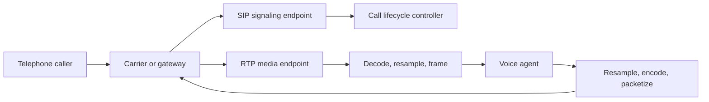

# 16. SIP, RTP, PSTN, and audio bridges

**Prerequisites:** chapters 2 and 15. **Goal:** trace a telephone call into a model session and back.

<!-- chapter-navigation:start -->
**In this chapter**

- [Signaling and media are separate](#signaling-and-media-are-separate)
- [Call lifecycle internally](#call-lifecycle-internally)
- [RTP and clocks](#rtp-and-clocks)
- [Codec conversion](#codec-conversion)
- [DTMF, transfer, and hangup](#dtmf-transfer-and-hangup)
- [Read a call sequence without confusing signaling with sound](#read-a-call-sequence-without-confusing-signaling-with-sound)
- [Calculate packet cadence and timestamps](#calculate-packet-cadence-and-timestamps)
- [Convert companded bytes into PCM samples](#convert-companded-bytes-into-pcm-samples)
- [Handle packet loss and jitter explicitly](#handle-packet-loss-and-jitter-explicitly)
- [Design DTMF and transfer workflows](#design-dtmf-and-transfer-workflows)
- [Debugging procedure](#debugging-procedure)
- [Check your understanding](#check-your-understanding)
<!-- chapter-navigation:end -->

## Signaling and media are separate

SIP establishes, modifies, and ends sessions. SDP describes media parameters such as codec and addressing. RTP carries timed media packets. PSTN is the traditional telephone network context; a gateway or carrier bridges between telephone service and IP systems.

SIP does not mean the audio is inside the signaling messages. A call can be established successfully while media is silent because RTP routing or codec negotiation failed.



This is a conceptual split. Some providers expose media over WebSocket instead of raw RTP. The application must follow the provider's actual protocol, not assume every phone integration opens an RTP socket.

## Call lifecycle internally

A typical SIP flow includes an invitation, provisional responses, session acceptance, acknowledgement, and eventual termination. State handling must include rejection, timeout, remote hangup, and failed transfer, not only a happy-path answer.

Call IDs correlate signaling; your application also needs a session ID and an authenticated context. A displayed caller number is not strong proof of identity. Keep account authentication separate from telephony metadata.

## RTP and clocks

RTP packets contain sequence and timestamp information associated with the negotiated payload type. Sequence numbers help identify loss and reordering; timestamps describe the sampling timeline. Their clock rate is defined by the payload format and is not always inferred from a WAV sample rate.

A jitter buffer reorders and schedules packets. Packet loss concealment can approximate missing sound but cannot recover every word. A recognizer downstream sees the concealed or gapped waveform, so log media loss when evaluating recognition.

## Codec conversion

Traditional narrowband routes often use 8 kHz G.711 audio, but modern phone systems may negotiate other codecs. Inspect the actual negotiation instead of assuming every call is narrowband.

A bridge for μ-law to 16 kHz PCM performs:

```text
receive encoded samples -> μ-law decode -> stateful resample
-> mono PCM frame assembly -> model input
```

The reverse path resamples model output to the negotiated media rate, encodes it, and packetizes at the expected cadence. Declaring 8 kHz audio to be 16 kHz speeds it up; expanding each byte to two bytes without proper decoding does not reconstruct PCM amplitudes.

Keep the resampler state across packets. Pacing matters: sending a full second of audio in one burst may create buffering even if packet bytes are correct.

## DTMF, transfer, and hangup

Keypad digits can be transported as dedicated events or audio tones depending on the route. Do not rely on STT to recognize digits when a reliable DTMF channel exists. Route them as typed input with their own validation.

A transfer involves signaling and business context. Define what happens when the destination is busy, when the bridge fails, or when the caller disconnects during transfer. Preserve a concise handoff summary and pending-operation state where permitted.

Remote hangup should stop media ingestion, cancel obsolete generation, release resources, and reconcile outstanding writes. Cleanup is not the same as reversing business actions.

## Read a call sequence without confusing signaling with sound

A simplified successful session can look like this:

```text
Caller/gateway                 SIP endpoint             Agent worker
    INVITE + SDP  ------------->
    <--------------- provisional response
    <--------------- 200 OK + SDP
    ACK ----------------------->
    RTP media <---------------> media bridge <---------> PCM/model session
    BYE ----------------------->
    <--------------- 200 OK
```

Provisional responses describe progress; final acceptance and acknowledgement establish signaling state under the protocol. A media bridge converts the negotiated stream into the agent's audio contract. Some routes support early media, and real call flows can include authentication challenges and other branches. Use this diagram as a starting trace, not a complete SIP implementation.

When signaling succeeds but audio is silent, inspect both media directions independently. The inbound route may work while outbound packets go to an unreachable address, or the bridge may decode one payload type and encode another incorrectly.

## Calculate packet cadence and timestamps

For a G.711 route with 8 kHz audio and one encoded byte per sample, a 20 ms payload contains 160 bytes. RTP adds a header, and UDP/IP plus any encryption add additional overhead. Payload size is not total network usage.

If packet A has RTP timestamp 1,000, the next 20 ms G.711 packet normally advances by 160 timestamp units, yielding 1,160. Sequence number advances by one packet. If sequence jumps by two but timestamp jumps by 320, one packet interval may have been lost. If timestamp advances while arrival timing is bursty, media time remains the basis for playout.

RTP timestamps are counters in a payload-defined clock, not Unix milliseconds. They wrap, and sequence numbers wrap sooner. Comparison requires wraparound-aware logic. Do not feed them directly into wall-clock duration subtraction.

Different payloads can use different timestamp rules. For example, a codec's RTP clock definition can differ from a decoder's application output sample rate. Use the negotiated payload specification rather than deriving everything from the model's PCM rate.

## Convert companded bytes into PCM samples

G.711 μ-law uses a nonlinear amplitude representation. Decoding maps each byte to a linear sample value according to the codec. The byte is not the low byte of a 16-bit integer, and multiplying it by 256 is not a decoder.

After decoding, a streaming resampler converts the 8 kHz timeline to the model's accepted rate, such as 16 kHz. A 20 ms decoded packet has 160 input samples and approximately 320 output samples at 16 kHz, subject to filter state and buffering. Frame assembly then creates the model's required input units without resetting conversion state every packet.

For output, convert in reverse: model PCM → required channels/level → resampling → G.711 encoding → timed packetization. Keep the true negotiated contract attached to the stream. Narrowband input cannot regain the original missing high-frequency speech detail merely by upsampling.

## Handle packet loss and jitter explicitly

A jitter buffer receives out-of-order packets and decides when to play each interval. Late packets may no longer be useful once their interval was concealed. Packet loss concealment estimates missing audio; it does not guarantee the recognizer sees the actual lost word.

If the user says “don't cancel” and the interval containing “don't” is damaged, the downstream transcript may express the opposite intent. Consequential workflows therefore need confirmation and task-level error checks, not just high average media quality.

Record loss/jitter evidence alongside ASR outcomes. A recognition regression caused by changed network conditions should not be mistaken for a model regression.

## Design DTMF and transfer workflows

If a caller enters account digits through a dedicated telephone-event channel, validate them as structured input. Preserve event identity and duration according to the integration. A tone heard in audio and the corresponding out-of-band event can represent the same press; do not count both as two digits.

For transfer, define states such as requested, destination-ringing, connected, failed, and caller-gone. Decide whether the assistant remains available while the destination rings and what happens when the destination rejects. A transfer API returning “accepted” may mean the request was accepted, not that a human answered.

Send permitted context to the receiving side: verified intent, completed operations, unresolved questions, and account scope. Avoid an unredacted full transcript by default. The handoff should not create another booking while re-establishing context.

## Debugging procedure

Test a controlled call with a known tone in each direction, then speech, then DTMF. Confirm negotiated codec, payload type, media endpoint, packet cadence, decode/resample counts, and actual output. Add remote hangup during a pending mock write. Verify media resources stop while the operation ledger still reconciles the write's outcome.

## Check your understanding

1. How can SIP succeed while audio fails?
2. Which conversion steps bridge μ-law to model PCM?
3. Why should caller ID not authorize account changes?

Continue with [diarization](17-diarization-and-conversation-understanding.md). [Lab 9](../labs/09-transport-and-phone.md). Primary references: [SIP](https://www.rfc-editor.org/rfc/rfc3261), [RTP](https://www.rfc-editor.org/rfc/rfc3550), and [RTP telephone events](https://www.rfc-editor.org/rfc/rfc4733).
