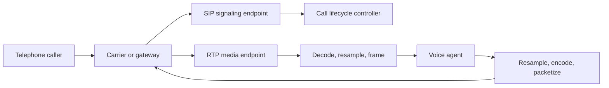

# 16. SIP, RTP, PSTN, and audio bridges

**Prerequisites:** chapters 2 and 15. **Goal:** trace a telephone call into a model session and back.

## Signaling and media are separate

SIP establishes, modifies, and ends sessions. SDP describes media parameters such as codec and addressing. RTP carries timed media packets. PSTN is the traditional telephone network context; a gateway or carrier bridges between telephone service and IP systems.

SIP does not mean the audio is inside the signaling messages. A call can be established successfully while media is silent because RTP routing or codec negotiation failed.



This is a conceptual split. Some providers expose media over WebSocket instead of raw RTP. The application must follow the provider's actual protocol, not assume every phone integration opens an RTP socket.

## Call lifecycle internally

A typical SIP flow includes an invitation, provisional responses, session acceptance, acknowledgement, and eventual termination. State handling must include rejection, timeout, remote hangup, and failed transfer, not only a happy-path answer.

Call IDs correlate signaling; your application also needs a session ID and an authenticated context. A displayed caller number is not strong proof of identity. Keep account authentication separate from telephony metadata.

## RTP and clocks

RTP packets contain sequence and timestamp information associated with the negotiated payload type. Sequence numbers help identify loss and reordering; timestamps describe the sampling timeline. Their clock rate is defined by the payload format and is not always inferred from a WAV sample rate.

A jitter buffer reorders and schedules packets. Packet loss concealment can approximate missing sound but cannot recover every word. A recognizer downstream sees the concealed or gapped waveform, so log media loss when evaluating recognition.

## Codec conversion

Traditional narrowband routes often use 8 kHz G.711 audio, but modern phone systems may negotiate other codecs. Inspect the actual negotiation instead of assuming every call is narrowband.

A bridge for μ-law to 16 kHz PCM performs:

```text
receive encoded samples -> μ-law decode -> stateful resample
-> mono PCM frame assembly -> model input
```

The reverse path resamples model output to the negotiated media rate, encodes it, and packetizes at the expected cadence. Declaring 8 kHz audio to be 16 kHz speeds it up; expanding each byte to two bytes without proper decoding does not reconstruct PCM amplitudes.

Keep the resampler state across packets. Pacing matters: sending a full second of audio in one burst may create buffering even if packet bytes are correct.

## DTMF, transfer, and hangup

Keypad digits can be transported as dedicated events or audio tones depending on the route. Do not rely on STT to recognize digits when a reliable DTMF channel exists. Route them as typed input with their own validation.

A transfer involves signaling and business context. Define what happens when the destination is busy, when the bridge fails, or when the caller disconnects during transfer. Preserve a concise handoff summary and pending-operation state where permitted.

Remote hangup should stop media ingestion, cancel obsolete generation, release resources, and reconcile outstanding writes. Cleanup is not the same as reversing business actions.

## Check your understanding

1. How can SIP succeed while audio fails?
2. Which conversion steps bridge μ-law to model PCM?
3. Why should caller ID not authorize account changes?

Continue with [diarization](17-diarization-and-conversation-understanding.md). [Lab 9](../labs/09-transport-and-phone.md). Primary references: [SIP](https://www.rfc-editor.org/rfc/rfc3261), [RTP](https://www.rfc-editor.org/rfc/rfc3550), and [RTP telephone events](https://www.rfc-editor.org/rfc/rfc4733).
